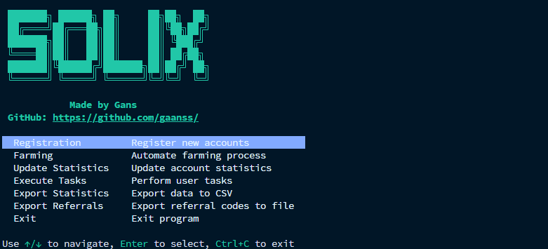

<p align="center">
  <a href="https://t.me/gans_software">
    
  </a>
  <a href="https://t.me/ganssoftwarechat">
    
  </a>
</p>

<p align="center">
  
</p>
# Solix DePIN Automation 🚀

A fully asynchronous Python 3.11+ tool to automate interactions with the Solix DePIN. Supports bulk registration, farming (connection quality), statistics updates, task automation, and CSV export.

## Features ✨
- 📝 **Bulk Registration** with Turnstile captcha solving
- 🌀 **Referral Codes**: support loading a list of codes from file and cycling per account
- 🌐 **Farming**: Periodic connection quality reporting
- 📊 **Statistics Update**: Fetch total/task/referral points
- 🤖 **Task Automation**: Follow/like/claim social tasks automatically
- 💾 **CSV Export**: Quick export
- 🔄 **Round-robin Proxies**: Per-account proxy assignment
- 🔒 **Captcha Solving**: CapSolver integration
- 🗄️ **SQLite DB**
- 🌈 **Rich CLI**: Interactive menu
- 📜 **Detailed Logs**

## Prerequisites 📋
- Python 3.11 or newer
- A valid CapSolver API key
- Input files in `data/`: `registration.txt`, `farming.txt`, `proxy.txt`

## Installation ⚙️
1. **Clone repository**:
   ```bash
   git clone https://github.com/gaanss/solix.git
   cd solix-automation
   ```

## Configuration 📝
Edit `settings.yaml` to match your environment:
```yaml
database:
  path: database/solix.db

captcha:
  provider: capsolver
  api_key: 'YOUR_CAPSOLVER_API_KEY'

proxy:
  file: data/proxy.txt
  rotate_on_error: true

registration:
  referral_code: ''           # Default referral code if no file provided
  referral_codes_file: data/referral_codes.txt  # File with one referral code per line (cycled)

update_stats:
  initial_delay_seconds: 1

tasks:
  execution_delay_seconds: 10

export:
  output_file: data/stats_export.csv

data_files:
  registration_list: data/registration.txt
  farming_list: data/farming.txt
```

## Data Files 📂
- **`data/registration.txt`** & **`data/farming.txt`**: one `email:password` per line
- **`data/proxy.txt`**: one `user:pass@host:port` proxy per line

## Usage 🚀
### Interactive Menu
Linux:
```bash
chmod +x solix
./solix
```
Windows (PowerShell/CMD):
```powershell
.\solix.exe
```

- Navigate with ↑/↓, press **Enter** to select.
- Modes: Registration, Farming, Update Stats, Execute Tasks, Export Stats, Exit.


## Modes 🛠️
- **Registration**: Bulk signup + token storage (supports rotating referral codes from a file)
- **Farming**: Continuous connection quality polling
- **Update Statistics**: One‑time total/task/referral point update
- **Execute Tasks**: Perform & claim social tasks
- **Export Statistics**: Dump DB to CSV (`data/stats_export.csv`)

## Logging 📜
- Uses `loguru` with levels: DEBUG, INFO, SUCCESS, ERROR
- Logs to console + file (`logs/app.log`)
- Key events (delays, successes, errors) are annotated with account email

## Proxy & Captcha 🌐🔒
- **Round‑Robin Proxies**: consistent assignment per account email
- **Captcha Solving**: CapSolver API with `AntiTurnstileTaskProxyLess` fallback

## Database 🗄️
- SQLite file at `database/solix.db` with table `accounts`
- Fields: email, password, tokens, referral code, stats, connection quality
